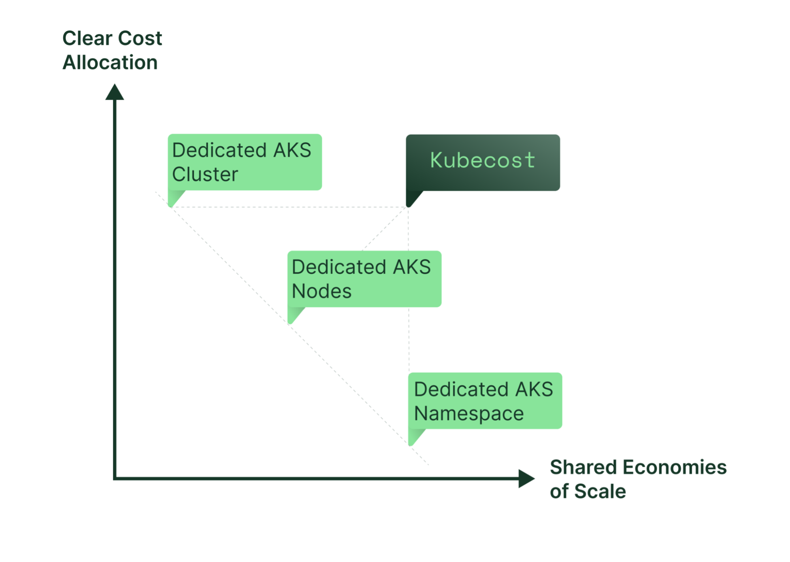
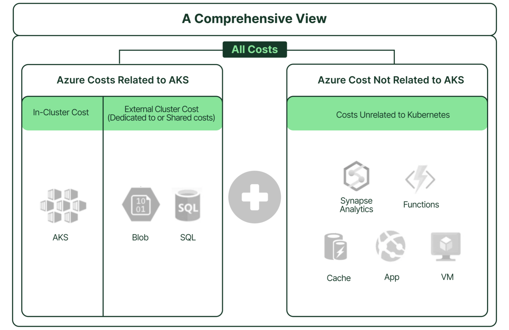
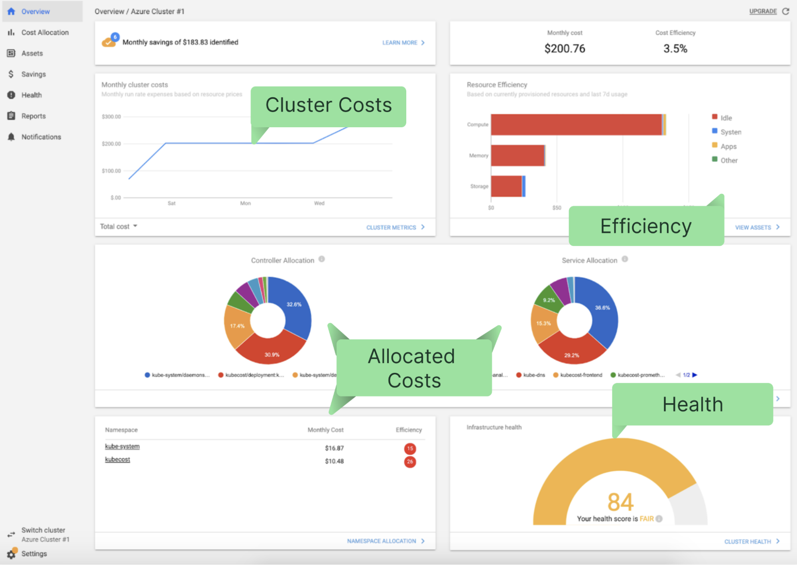
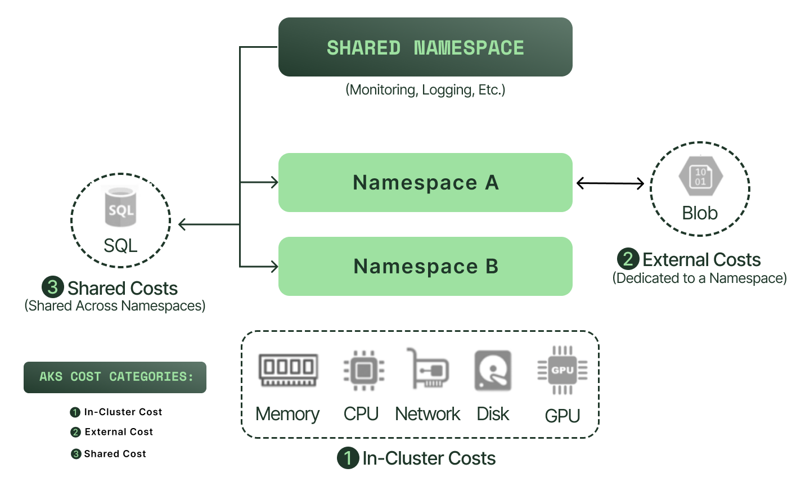
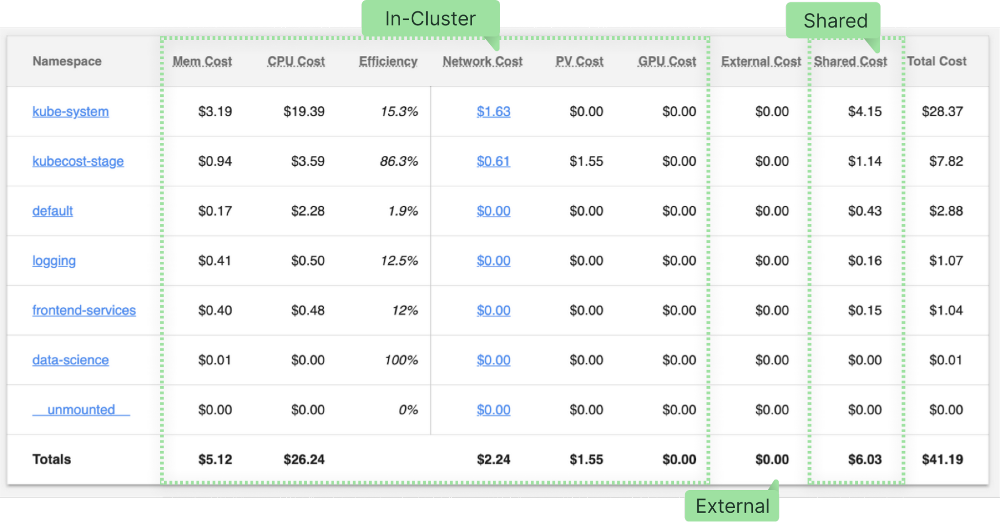
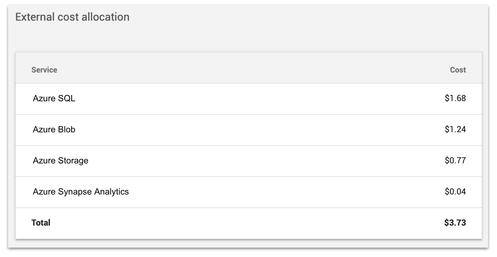
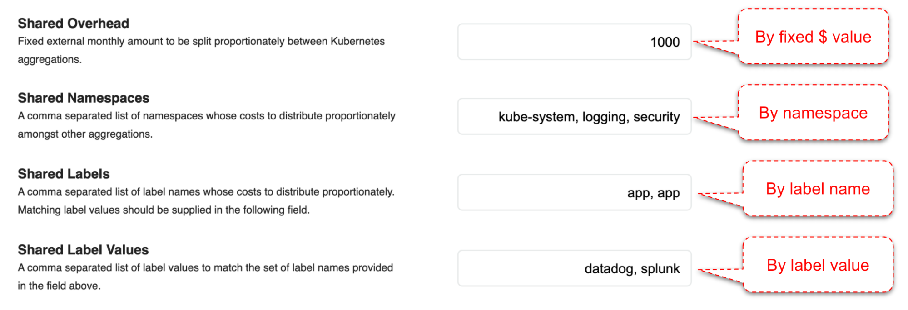
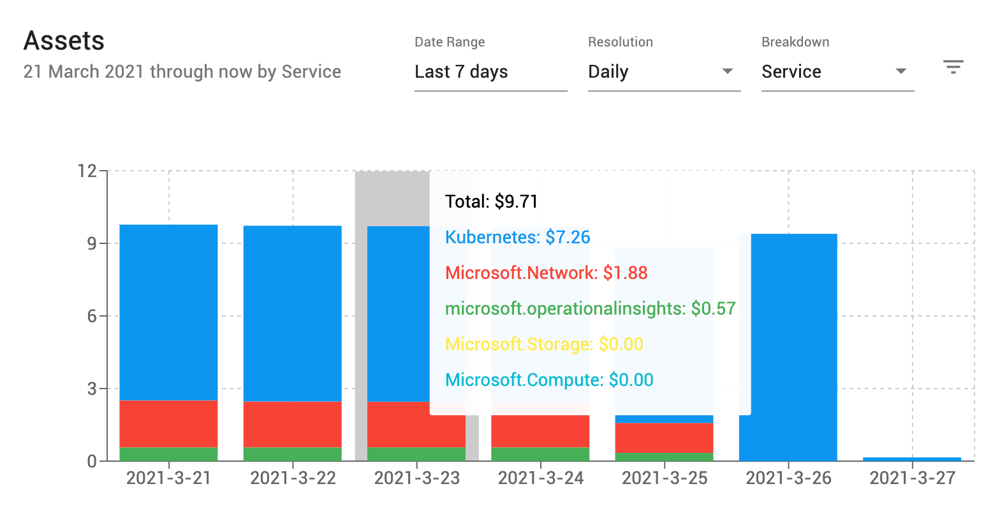
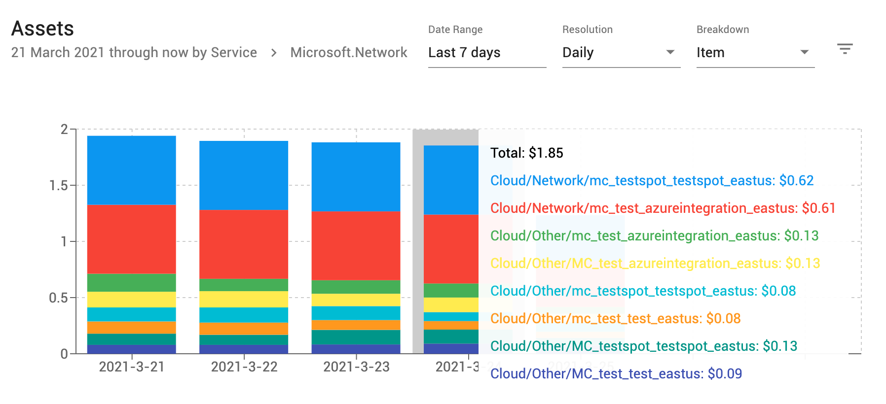
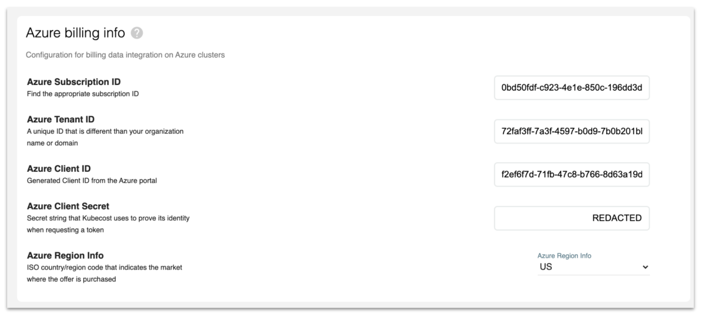

# Monitoring and Governance for AKS Costs with Kubecost

When running Azure Kubernetes Service (AKS), it can be hard to understand and allocate costs in environments with multiple teams, projects, or even departments. With [Kubecost](https://www.kubecost.com/), you gain full transparency into your Kubernetes usage and cost within minutes of installation. Officially launched in 2019 and built on open source, Kubecost now monitors over one billion dollars in Kubernetes spend, and enables startups and global enterprises alike to understand their spend and identify cost savings ranging from 30% to over 50%. Kubecost supports self-managed upstream Kubernetes environments as well as those hosted in Google Cloud Engine and Amazon Web Services, as well as Microsoft Azure, which we’ll cover today in this article.

The Microsoft [Azure Kubernetes Service](https://azure.microsoft.com/en-us/services/kubernetes-service/) (AKS) is a [popular](https://security.stackrox.com/rs/219-UEH-533/images/State_of_Container_and_Kubernetes_Report.pdf) fully managed Kubernetes service that offers embedded continuous integration and continuous delivery as well as enterprise-grade security and governance— powerful tools for teams adopting Kubernetes. As with any complex infrastructure, AKS requires proper governance and financial transparency for successful organizational adoption. Kubecost, an open source tool that provides teams with visibility into Kubernetes spend and supports environments hosted in Azure, is a widely recommended solution for engineers and finance teams facing this problem. _Note: This [documentation page](https://docs.microsoft.com/en-us/azure/cloud-adoption-framework/scenarios/aks/eslz-security-governance-and-compliance#cost-governance) for AKS provides helpful context for using Kubecost to implement a cost governance strategy._


## The Cost Allocation Challenge 

Kubernetes clusters are often shared across teams, microservices, projects, applications, departments, and cost centers to save on infrastructure and administrative overhead. The most popular methods for organizing this shared platform is by simply using labels (similar to tags) or by creating [namespaces](https://kubernetes.io/docs/concepts/overview/working-with-objects/namespaces/). A Kubernetes namespace is a logical separation inside a Kubernetes cluster which could be assigned to a particular team, application, or even a business unit.

Most organizations map a namespace to a specific workload type or purpose. For example, a typical cluster might have one namespace for monitoring and one namespace for logging for use by the DevOps teams who maintain the cluster. A customer-facing application hosted in that same cluster might have one namespace for its front-end components and a separate namespace for its back-end services. 

Creating these logical divisions inside a cluster is administratively convenient, but adds complexity when trying to accurately measure resource usage and allocate costs to each tenant based on detailed billing data.


### Sharing a Kubernetes Cluster in Azure

There are three models for sharing Azure Kubernetes Service (AKS) clusters across cost centers:


1. **Dedicated AKS cluster**: Each team or project gets its own dedicated AKS cluster to easily track its billing. This approach does not benefit from resource sharing. \

2. **Dedicated AKS node**: Each team or project gets its [pods assigned to a specific node](https://kubernetes.io/docs/concepts/scheduling-eviction/assign-pod-node/) in a shared AKS cluster using labels and a configuration constraint known as nodeSelector. Each team can then isolate its spending in the Azure bill according to the cost of its assigned nodes. Resource sharing is not efficient in this model. \

3. **Dedicated AKS Namespace**: Each team or project gets its own dedicated namespace along with more flexibility and administrative freedom. This model, as we have mentioned, can be challenging for cost allocation. However, this is where Kubecost comes in.  





FIXME CAPTION With Kubecost, you can share AKS clusters and still clearly allocate shared costs.

### The Measurement Challenge

Suppose you have chosen to support multiple projects and teams on your AKS cluster using a few dozen namespaces. In this example, each team has its own namespace and autonomous administrative control over provisioning pods and containers. After a couple of months, the cluster costs are higher than expected, and you would like to identify the cause of the spending jump. It’s a simple question, but complicated to answer, because you must measure resource usage by workloads in each namespace over multiple weeks to come to a conclusion. 

This means that you must allocate the following by namespace:

1. The actual usage of CPU, GPU, memory, network, and persistent storage.
2. The excessive requests for CPU and memory leaving resources unused.  
3. The usage of shared resources such as databases or blob storage.
4. The proportionate use of cloud instance reservations and support services.


FIXME CAPTION An accurate cost allocation by project, team, or cost center must consider all factors.

If you take just network usage as one example, you are required to:

1. Measure the egress traffic generated by containers belonging to each namespace across regions, availability zones, and out to the internet.
2. Determine the data transfer rates that may be negotiated with your cloud provider. 

Only then can you measure the networking costs associated with each namespace. 

This process is daunting, especially when you consider the fact that it requires:

*   Specialized telemetry for collecting relevant data in real-time
*   Storage of time-series data over time
*   Collection and analysis of cloud provider’s detailed billing logs 
*   Analysis of usage and cost data to calculate the accurate costs
*   Presentation of the results in the form of reports or dashboards


### Don’t Sidestep the Challenge 

Leaving this challenge unresolved leads to organizational frustration in the long run as you struggle to identify the root cause of a spending jump or struggle to respond to a management request for what seems a simple report of cost allocation by application, team, or project. A sudden increase in spending due to misconfiguration would be a routine operational matter if noticed within hours or days, but when left lurking in the shadows for weeks or months, even a simple misconfiguration can fester into an end-of-quarter budgeting drama. 

Although Kubernetes delivers on the promise of economies of scale and auto-scaling, it requires proper governance and financial transparency for sustained, successful organizational adoption. 


## One Comprehensive View

Having a high-level summary view of your resource usage and spend while also being able to drill down into the details is a universal ideal applicable to just about any domain. In the case of Kubernetes hosted in Azure, there are two types of comprehensive summarized views:

1. Azure resources directly or indirectly related to Azure Kubernetes Service 
2. Azure services unrelated to AKS, e.g. other Azure Virtual Machines

Having both views in a single tool avoids the need to switch between consoles and reconcile billing information.



FIXME CAPTION A comprehensive view should include AKS-related and non-AKS-related costs

### Azure Costs Related to Kubernetes

The costs directly associated with Kubernetes in Azure are the costs of the nodes that form the Kubernetes cluster, including the network and persistent storage volumes that support the nodes. Costs can be broken down into charges associated with:

*   CPU
*   Memory
*   GPU
*   Network
*   Storage Volumes 

There are also external costs associated with a Kubernetes cluster or namespace. These charges may be dedicated to each namespace or Kubernetes resource, or they may be shared across multiple namespaces. For example, a proxy server may be accessed by all containers regardless of the namespace, and therefore its cost would be shared across all namespaces. 

The table below summarizes the types of costs that you must account for to have an accurate view of your spending by namespace:

<table>
  <tr>
   <td>Kubernetes Cost Type
   </td>
   <td>Kubernetes Cost Description
   </td>
   <td>Examples
   </td>
  </tr>
  <tr>
   <td>In-Cluster
   </td>
   <td>The cost of the nodes that make up the cluster 
   </td>
   <td>CPU, memory, storage, network, and GPU 
   </td>
  </tr>
  <tr>
   <td>External
   </td>
   <td>The cost of Azure services dedicated to an individual namespace
   </td>
   <td>Azure SQL, Azure Blob, Azure Synapse Analytics 
   </td>
  </tr>
  <tr>
   <td>Shared
   </td>
   <td>The cost of services shared by all namespaces
   </td>
   <td>kube-system namespace, common labor costs
   </td>
  </tr>
</table>

## The Kubecost Approach

Kubecost is popular because of its rich set of functionality, ease of implementation, and its attentive support team. As pioneers in Kubernetes FinOps, Kubecost and its early adopters helped define many of the modern concepts behind financial reporting on shared Kubernetes resources in a hosted cloud environment. 

### Azure Integration 

Later in this article, we’ll go over how to install Kubecost in a Kubernetes cluster using Helm and integrate it with Azure. But first, it’s important to know that Kubecost is installed within the Kubernetes cluster and does not transmit any data outside of your cluster, meaning you won’t have to worry about sensitive data leaving your environment.

Kubecost collects data from the Azure Billing Rate Card API (using a role definition that you create) to provide accurate cost information based on your detailed billing records. Kubecost’s Azure integration collects your exact pricing data to account for any special pricing, such as Azure reservations, in its analyses. Additionally with integration to your Azure Storage Account, Kubecost is able to reconcile exact costs of your in-cluster usage and display them alongside out-of-cluster costs for an accurate and holistic view of your cloud spend. 


FIXME CAPTION Kubecost uses the Microsoft Azure Billing Rate Card API to gather accurate and detailed cost information

### Main Dashboard

Once the installation process is completed, you can then access the main dashboard, where each cluster also has its own dedicated view, which includes:

*   Total monthly spending 
*   Efficiency (the ratio of utilized to idle resources over time) 
*   Cost allocation by Kubernetes controller, service, namespace
*   Cluster health (based on preset rules of reliability and risk best practices)



FIXME CAPTION Kubecost’s main dashboard summarizes costs, health, and efficiency

### Navigation Options

As you might have noticed, the navigation menu visible on the left side of the previous screenshot presents a number of other reports and dashboards available to Kubecost users. These tools include:

*   **Cost Allocation:** Group costs by Kubernetes meta-data and Azure tags
*   **Assets:** View all of your Azure spending beyond AKS
*   **Savings:** Get recommendations for cost savings based on preset best practices
*   **Health**: See your cluster’s health score based on preset best practices 
*   **Reports:** Group, filter, sort detailed cost information and store for later
*   **Notifications:** Configure cost alerts based on cluster or namespace budgets

We won’t cover all of the functionalities offered by these tools in this article; we will highlight the primary ones related to Azure billing and Kubernetes cost allocation. 

### Cost Allocation

As referenced earlier in this article, costs associated with a Kubernetes cluster fall into the following categories:

1. **In-cluster**: AKS costs of Memory, CPU, network, storage, and GPU 
2. **External**: Azure costs dedicated to each Kubernetes component
3. **Shared**: Azure services or fixed costs shared across Kubernetes components

The diagram below uses a grouping by namespace to illustrate these concepts including the option to allocate the cost of a shared cluster namespace across other namespaces:



FIXME CAPTION AKS costs in Kubecost include in-cluster costs, out-of-cluster or external costs, and shared costs.

The user interface displays the cost categories highlighted in this screenshot:



FIXME CAPTION Kubecost cost allocation report for Azure AKS

This functionality requires you to export your Azure cost report into an Azure storage by following [these instructions](https://docs.microsoft.com/en-us/azure/cost-management-billing/costs/tutorial-export-acm-data?tabs=azure-portal) (select the daily month-to-date option for the export and wait a few hours to populate) and allowing Kubecost to securely access it via the Azure storage API by creating a JSON file named **_azure-storage-config.json_** with your secret information formatted as below.


```
{
	"azureStorageAccount": "<STORAGE_ACCOUNT_NAME>",
	"azureStorageAccessKey": "<STORE_ACCESS_KEY>",
	"azureStorageContainer": <REPORT_CONTAINER_NAME>
}
```


You can then use this command to create the secret:


```
kubectl create secret generic <SECRET_NAME> --from-file=azure-storage-config.json -n kubecost
```


Once the secret is created, set `.Values.kubecostProductConfigs.azureStorageSecretName` to `<SECRET_NAME>` and upgrade Kubecost via helm. You can also follow the more [detailed instructions](https://github.com/kubecost/docs/blob/master/azure-out-of-cluster.md). 

Later in this article, we provide instructions for using helm to install Kubecost and share links to relevant instructions pages. 


### Cost Breakdown 

One of the nice features of Kubecost is that you can select just about any line item on the screen and drill down to see more information. For example, in the case of external costs highlighted in the previous screenshot, selecting a specific value would present  a breakdown of the charges:



FIXME CAPTION Kubecost’s Detailed Azure Cost View

### Allocating External Azure Costs Using Tags

Now that you have learned about the concepts of in-cluster, external, and shared Azure costs in Kubecost, it may be helpful to know how you can control the allocations. Kubecost uses tags and labels to allocate Azure spending outside of the Kubernetes cluster to specific Kubernetes components, such as pods and namespaces. 

For example, you could take the costs related to a SQL instance and associate them with a specific pod. Suppose you have a namespace called “app-backend” containing microservices with their own dedicated Azure SQL database. This database is provisioned under the [Managed Instance](https://docs.microsoft.com/en-us/azure/azure-sql/managed-instance/sql-managed-instance-paas-overview) model, and you would like all of its costs to be attributed to this one specific namespace in the form of external costs. In this scenario, you would apply a tag to the SQL database instance with the tag key “kubernetes_namespace” and the tag-value “app-backend.”  That’s it -- the next time you visit Kubecost and use the Cost Allocation view (grouped by namespace), the costs of the SQL instance will be shown in the appropriate row, under the column titled “external costs''. The table below shows the various tags available in Kubecost to accomplish this type of mapping: 


<table>
  <tr>
   <td>Kubernetes Component
   </td>
   <td>Azure Key
   </td>
   <td>Azure Value
   </td>
  </tr>
  <tr>
   <td>Cluster
   </td>
   <td>kubernetes_cluster	
   </td>
   <td>&lt;cluster-name>
   </td>
  </tr>
  <tr>
   <td>Namespace
   </td>
   <td>kubernetes_namespace
   </td>
   <td>&lt;namespace-name>
   </td>
  </tr>
  <tr>
   <td>Deployment
   </td>
   <td>kubernetes_deployment
   </td>
   <td>&lt;deployment-name>
   </td>
  </tr>
  <tr>
   <td>Label
   </td>
   <td>kubernetes_label_NAME
   </td>
   <td>&lt;label-value>
   </td>
  </tr>
  <tr>
   <td>DaemonSet
   </td>
   <td>kubernetes_daemonset
   </td>
   <td>&lt;daemonset-name>
   </td>
  </tr>
  <tr>
   <td>Pod
   </td>
   <td>kubernetes_pod	
   </td>
   <td>&lt;pod-name>
   </td>
  </tr>
  <tr>
   <td>Container
   </td>
   <td>kubernetes_container
   </td>
   <td>&lt;container-name>
   </td>
  </tr>
</table>


You can learn more about tagging using the Azure portal on [this page](https://docs.microsoft.com/en-us/azure/virtual-machines/tag-portal).

Next, we’ll show you how to use tags to control the allocation of shared resources in the Kubecost Settings user interface.


### Cost Allocation Configuration

Kubecost makes it easy to configure the allocation of shared costs to Kubernetes components. Shared resources may be in the form of:


1. **Fixed dollar value:**  For example, $1,000 may be shared across all namespaces
2. **Shared namespace:** For example, the cost of the default “kube-system” namespace may be spread out. The configuration field accepts a list of common-separated namespaces. 
3. **Share by label:** For example, the cost of pods with a label of app=splunk may be distributed. Note that in the screenshot below, the tag key named “app” is repeated and separated by a comma to capture both the “datadog” value for the key named “app” and the value “splunk” for the same key named “app.”



FIXME CAPTION Allocation of shared costs are controlled in the Kubecost Settings page 

The fixed dollar value is a simple and elegant solution for allocating costs of any type. For example, you may attribute the proportional maintenance labor cost of the cluster to each namespace so that your financial report reflects a fully-loaded cost. 

The namespace sharing feature allows you to take the costs associated with multiple namespaces and distribute them among all of the other namespaces. A namespace dedicated to hosting security software intended to protect the entire cluster is a great candidate for this feature; kube-system is another great candidate, which is created by the Kubernetes system to host common utilities such as kube-dns and kube-proxy. 

The third sharing feature uses labels to select just about any Kubernetes component and distribute costs proportionally among them. For example, you may have pods running your user acceptance testing (UAT) environment -- with labels, you could take all of your UAT costs and spread them across your production namespaces so that the cost of testing your software is included in your application costs. 

The shared costs are allocated proportionally to the percentage of in-cluster resource costs the namespaces are consuming (CPU, memory, network, storage, and GPU) so a namespace that uses more of the cluster resources would get a higher allocation of shared expenses. However, you can also instruct Kubecost to distribute the costs equally (independent of usage) across all of the namespaces for a uniform distribution.


### Azure Cloud Assets 

So far, we focused on Kubernetes components; however, one of the exciting features introduced by Kubecost as part of its support for Azure is the ability to extend the comprehensive view to include all of your Azure spending (even if not related to AKS). 

This view is accessible on the navigation menu, under the section titled Assets, and it supports a full set of controls to filter, group, and sort your Azure bill in every dimension.



FIXME CAPTION The Assets view shows all Azure spending, not just AKS

You can drill down into specific billing record details simply by selecting them. For example, the following screenshot drills into the networking charges and shows itemized charges for load balancers or specific spot instances:



FIXME CAPTION Click to drill down into a detailed itemized view of costs

### Getting Started With Installation

There are 3 steps to install Kubecost in Azure and enable access to billing data:

1. Install Kubecost using a Helm chart. 
2. Create an Azure role definition for Kubecost in your Azure account.
3. Enter your account information on the Kubecost Settings page.

Kubecost is available for download as a Helm chart at this link: [https://www.kubecost.com/install.html](https://www.kubecost.com/install.html) and should take less than 5 minutes to install in AKS. 

Once you have installed Kubecost in an Azure account, you must then create an Azure role definition to provide access privileges to Kubecost in the form of JSON files. This is required for accessing accurate billing data via the Billing Rate Card API. Detailed instructions for creating an Azure role definition and sharing it with Kubecost are provided on this Kubecost documentation page: [http://docs.kubecost.com/azure-config](http://docs.kubecost.com/azure-config.html) while Microsoft Azure’s own [instruction page](https://docs.microsoft.com/en-us/azure/cloud-adoption-framework/scenarios/aks/eslz-security-governance-and-compliance#cost-governance) for integrating with Kubecost also documents the installation steps. 

The last step is to enter your Azure Subscription, Tenant, Client ID, and Client Secret in the Kubecost’s Settings user interface. 


 

FIXME CAPTION Azure integration information is entered in the Kubecost Settings page

## Conclusion

You don’t have to accept an AKS cluster as a financial black box. With Kubecost, you can share your AKS cluster with other teams and still generate a cost allocation report within minutes of installation. Kubecost also monitors your cluster’s health and efficiency -- it’s even able to send [cost notification alerts](http://docs.kubecost.com/alerts.html) when your namespace experiences an unexpected jump in spending. Look for other Kubecost articles and [documentation pages](http://docs.kubecost.com/) to learn more about its growing list of functionalities. 
